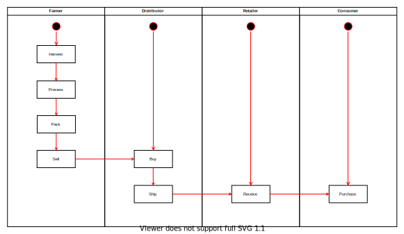
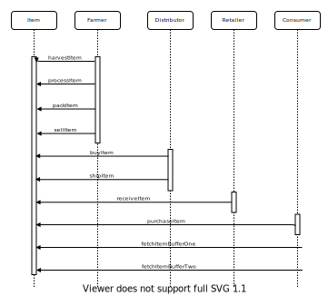
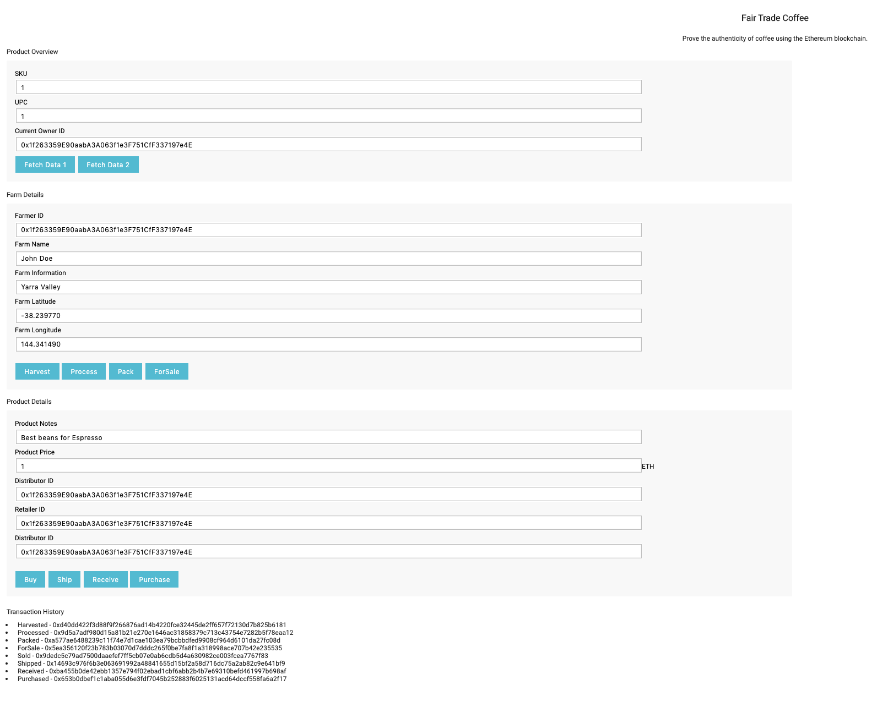

 ## Tracking Coffee Along a Supply Chain
 
 Dapp to provide 'farm to cup' traceability of coffee using smart contracts on the Ethereum blockchain.
 
 #### Architecture
 
 Activity Diagram
 
 
 
 State Diagram 
 
 
 
 Sequence Diagram 
 
 
 
 Data Model
 
 
 
 
 #### Libraries and Development

The smart contracts were developed and deployed using:
* Truffle v5.1.9 
* Solidity v0.4.24 
* Node v12.14.1
* Web3.js v1.2.1


 #### Smart Contract Infromation
 
 Contracts deployed to the Ropsten public test network
 
 SupplyChain Transaction hash: 0x8049b1277d5705f84e011b0a5bdcca15663cdd0598655d906081da4527710351
 SupplyChain Contract address: 0x19e1e4Af525539741220bF6EE968e34a9BBEfa81

 Deployment Details
 
 ```bash
Starting migrations...
======================
> Network name:    'ropsten'
> Network id:      3
> Block gas limit: 0x7a121d


1_initial_migration.js
======================

   Deploying 'Migrations'
   ----------------------
   > transaction hash:    0xc37db6cdfda225973ad7cf490e344c8f3a48240dd4b3bf0bf6f9f0875368fc7c
   > Blocks: 2            Seconds: 9
   > contract address:    0x0fD72Fde4e3c9508478100952b8244c6110D46BD
   > block number:        7269893
   > block timestamp:     1580942987
   > account:             0x287Ad6d9F2994b8957C853282898D5151EB7B556
   > balance:             4.30763207
   > gas used:            238594
   > gas price:           20 gwei
   > value sent:          0 ETH
   > total cost:          0.00477188 ETH


   > Saving migration to chain.
   > Saving artifacts
   -------------------------------------
   > Total cost:          0.00477188 ETH


2_deploy_contracts.js
=====================

   Deploying 'FarmerRole'
   ----------------------
   > transaction hash:    0xb3aceaf4532442af24d6b312f0ca85071673244a58b910320e9ce7d3b52753c3
   > Blocks: 1            Seconds: 12
   > contract address:    0x7BB8c083127192E3D6A1876E80dB959b1E789fC2
   > block number:        7269896
   > block timestamp:     1580943035
   > account:             0x287Ad6d9F2994b8957C853282898D5151EB7B556
   > balance:             4.30006481
   > gas used:            336015
   > gas price:           20 gwei
   > value sent:          0 ETH
   > total cost:          0.0067203 ETH


   Deploying 'DistributorRole'
   ---------------------------
   > transaction hash:    0xc80dfe8c933ee22b92a3ff99957025617f85c2c21f6284bd9011e7452f5c6c27
   > Blocks: 1            Seconds: 37
   > contract address:    0xC3f0584fc444969a68a3581e074b472C08fAfBe8
   > block number:        7269898
   > block timestamp:     1580943071
   > account:             0x287Ad6d9F2994b8957C853282898D5151EB7B556
   > balance:             4.29334307
   > gas used:            336087
   > gas price:           20 gwei
   > value sent:          0 ETH
   > total cost:          0.00672174 ETH


   Deploying 'RetailerRole'
   ------------------------
   > transaction hash:    0xfe5d97da066f9d2bc92b243905fb6f992f1361fe6d8d23754dcf6e0a829347db
   > Blocks: 1            Seconds: 28
   > contract address:    0xd02bfe1de5ef6CB01C4a85C62F403B8f9c21e268
   > block number:        7269900
   > block timestamp:     1580943111
   > account:             0x287Ad6d9F2994b8957C853282898D5151EB7B556
   > balance:             4.28662181
   > gas used:            336063
   > gas price:           20 gwei
   > value sent:          0 ETH
   > total cost:          0.00672126 ETH


   Deploying 'ConsumerRole'
   ------------------------
   > transaction hash:    0x0276624cbf3cba6dad7351e1b72ab2b3d98a66245723e63dba378871ff990fc3
   > Blocks: 0            Seconds: 9
   > contract address:    0x77cE4b2C024a46c22aB640D63A31Dd21a09cB9dE
   > block number:        7269901
   > block timestamp:     1580943122
   > account:             0x287Ad6d9F2994b8957C853282898D5151EB7B556
   > balance:             4.27990103
   > gas used:            336039
   > gas price:           20 gwei
   > value sent:          0 ETH
   > total cost:          0.00672078 ETH


   Deploying 'SupplyChain'
   -----------------------
   > transaction hash:    0x8049b1277d5705f84e011b0a5bdcca15663cdd0598655d906081da4527710351
   > Blocks: 0            Seconds: 13
   > contract address:    0x19e1e4Af525539741220bF6EE968e34a9BBEfa81
   > block number:        7269903
   > block timestamp:     1580943155
   > account:             0x287Ad6d9F2994b8957C853282898D5151EB7B556
   > balance:             4.22360511
   > gas used:            2814796
   > gas price:           20 gwei
   > value sent:          0 ETH
   > total cost:          0.05629592 ETH


   > Saving migration to chain.
   > Saving artifacts
   -------------------------------------
   > Total cost:             0.08318 ETH


Summary
=======
> Total deployments:   6
> Final cost:          0.08795188 ETH


```
 
 #### Dapp 
 
  